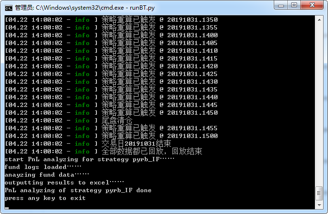
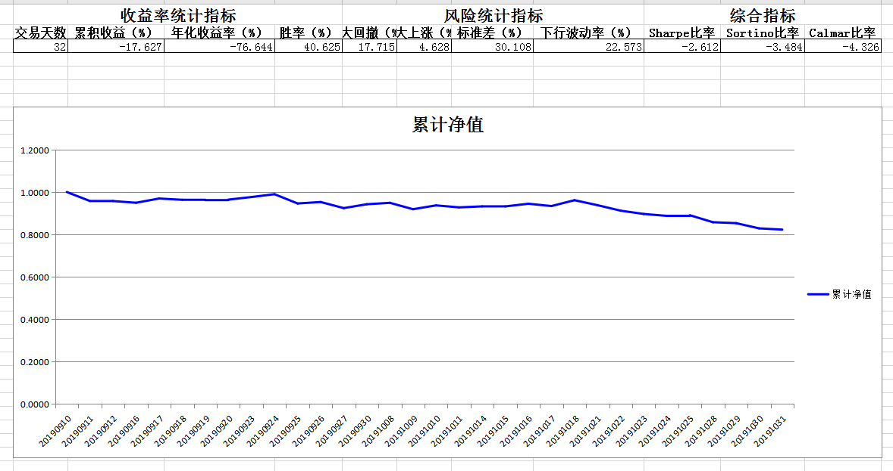

### 编写自己的策略
---
* 安装wtpy
    打开命令行，输入以下指令直接安装
    ```shell
    $ pip install wtpy --upgrade
    ```
    或者直接下载whl文件到本地进行安装
    阿里云镜像地址：<https://mirrors.aliyun.com/pypi/simple/wtpy/>
    pipy地址：<https://pypi.org/project/wtpy>

* 确定策略模型
    我们选择一个知名度相对较高的R-Breaker模型来进行编写。模型的原理可以参考如下文档：
    [解密并强化日内经典策略R-Breaker](https://zhuanlan.zhihu.com/p/86399960)

     R-Breaker的策略逻辑由以下4部分构成：      

        1）计算6个目标价位
        根据昨日的开高低收价位计算出今日的6个目标价位，按照价格高低依次是：
        
        突破买入价（Bbreak）
        观察卖出价（Ssetup）
        反转卖出价（Senter）
        反转买入价（Benter）
        观察买入价（Bsetup）
        突破卖出价（Sbreak）
        他们的计算方法如下：（其中a、b、c、d为策略参数）
        
        观察卖出价（Ssetup）= High + a * (Close – Low)
        观察买入（Bsetup）= Low – a * (High – Close)
        反转卖出价（Senter）= b / 2 * (High + Low) – c * Low
        反转买入价（Benter）= b / 2 * (High + Low) – c * High
        突破卖出价（Sbreak）= Ssetup - d * (Ssetup – Bsetup)
        突破买入价（Bbreak）= Bsetup + d * (Ssetup – Bsetup)
        
        2）设计委托逻辑
        
        趋势策略情况：
        
        若价格>突破买入价，开仓做多；
        若价格<突破卖出价，开仓做空；
        反转策略情况：
        
        若日最高价>观察卖出价，然后下跌导致价格<反转卖出价，开仓做空或者反手（先平仓再反向开仓）做空；
        若日最低价<观察买入价，然后上涨导致价格>反转买入价，开仓做多或者反手（先平仓再反向开仓）做多；
        3）设定相应的止盈止损。
        
        4）日内策略要求收盘前平仓。

* 确定策略要用的参数
    根据上述的策略逻辑，我们可以确定出策略要用到的几个基本参数：
    * K线追溯条数**N**，用于确定N日最高价、最低价、收盘价3个数据
    * 观察价格系数**a**，用于计算观察买入价和卖出价
    * 反转价格系数**b**、**c**，用于计算反转买入价和卖出价
    * 突破价格系数**d**，用于计算突破买入价和卖出价
    * 清仓截止时间**cleartime**，用于判定是否需要清仓出场
    
    以及非策略逻辑要用到的参数：
    * 策略名**name**
    * 交易标的**code**
    * K线周期**period**
    * 要拉取的K线条数**barCnt**

* 策略实现
    ```python
    from wtpy import BaseCtaStrategy
    from wtpy import CtaContext
    
    class StraRBreaker(BaseCtaStrategy):
    
        def __init__(self, name:str, code:str, barCnt:int, period:str, N:int, a:float, b:float, c:float, d:float, cleartimes:list):
            BaseCtaStrategy.__init__(self, name)
    
            self.__N__ = N
            self.__a__ = a
            self.__b__ = b
            self.__c__ = c
            self.__d__ = d
    
            self.__period__ = period
            self.__bar_cnt__ = barCnt
            self.__code__ = code
            self.__cleartimes__ = cleartimes    # 尾盘清仓需要多个时间区间，因为夜盘和白盘都要清仓，格式如[[1455,1515],[2255,2300]]
    
        def on_init(self, context:CtaContext):
            code = self.__code__
            context.stra_get_bars(code, self.__period__, self.__bar_cnt__, isMain = True)
            context.stra_log_text("R-Breaker inited")
    
        
        def on_calculate(self, context:CtaContext):
            code = self.__code__    #品种代码
    
            #读取当前仓位
            curPos = context.stra_get_position(code)
            curTime = context.stra_get_time()
    
            bCleared = False
            for tmPair in self.__cleartimes__:
                if curTime >= tmPair[0] and curTime <= tmPair[1]:
                    if curPos != 0: # 如果持仓不为0，则要检查尾盘清仓
                        context.stra_set_positions(code, 0, "clear") # 清仓直接设置仓位为0
                        context.stra_log_text("尾盘清仓")
                    bCleared = True
                    break
    
            if bCleared:
                return
    
            df_bars = context.stra_get_bars(code, self.__period__, self.__bar_cnt__, isMain = True)
            N = self.__N__
            a = self.__a__
            b = self.__b__
            c = self.__c__
            d = self.__d__
    
            #平仓价序列、最高价序列、最低价序列
            closes = df_bars["close"]
            highs = df_bars["high"]
            lows = df_bars["low"]
    
            #读取days天之前到上一个交易日位置的数据
            hh = highs[-N:].max()   #N条最高价
            ll = lows[-N:].min()    #N条最低价
            lc = closes.iloc[-1]    #最后收盘价
    
            Ssetup = hh + a * (lc - ll)
            Bsetup = ll - a * (hh - lc)
            Senter = b / 2 * (hh + ll) - c * ll
            Benter = b / 2 * (hh + ll) - c * hh
            Sbreak = Ssetup - d * (Ssetup - Bsetup)
            Bbreak = Bsetup + d * (Ssetup - Bsetup)
    
            curPx = lc  #最新价就是最后一个收盘价
    
            if curPos == 0:
                if curPx >= Bbreak:
                    context.stra_enter_long(code, 1, 'rb-bbreak')
                    context.stra_log_text("向上突破%.2f>=%.2f，多仓进场" % (curPx, Bbreak))
                elif curPx <= Sbreak:
                    context.stra_enter_short(code, 1, 'rb-sbreak')
                    context.stra_log_text("向下突破%.2f<=%.2f，空仓进场" % (curPx, Bbreak))
            elif curPos > 0:
                if curPx <= Senter:
                    context.stra_enter_short(code, 1, 'rb-senter')
                    context.stra_log_text("向下反转%.2f<=%.2f，多反空" % (curPx, Senter))
            elif curPos < 0:
                if curPx >= Benter:
                    context.stra_enter_long(code, 1, 'rb-benter')
                    context.stra_log_text("向上反转%.2f>=%.2f，空反多" % (curPx, Benter))


        def on_tick(self, context:CtaContext, code:str, newTick:dict):
            return
    
        def on_bar(self, context:CtaContext, code:str, period:str, newBar:dict):
            return
    
    ```

### 回测自己的策略
---
* 首先从demo里选择期货回测demo: [cta_fut_bt](https://github.com/wondertrader/wtpy/tree/master/demos/cta_fut_bt)

* 将策略模块`RBreaker.py`复制到`strategies/`目录下

* 修改runBT.py，设置好RBreaker策略的参数
    ```python
    from wtpy import WtBtEngine,EngineType
    from wtpy.apps import WtBtAnalyst

    from Strategies.DualThrust import StraDualThrust

    if __name__ == "__main__":
        #创建一个运行环境，并加入策略
        engine = WtBtEngine(EngineType.ET_CTA)
        engine.init('../common/', "configbt.yaml")
        engine.configBacktest(201909100930,201912011500)
        engine.configBTStorage(mode="csv", path="../storage/")
        engine.commitBTConfig()
    
        straInfo = StraRBreaker(name='pyrb_IF', code="CFFEX.IF.HOT", barCnt=50, period="m5", N=30, a=0.35, b=1.07, c = 0.07, d=0.25, cleartimes=[[1455,1515]])
        engine.set_cta_strategy(straInfo)
    
        engine.run_backtest()
    
        analyst = WtBtAnalyst()
        analyst.add_strategy("pyrb_IF", folder="./outputs_bt/pyrb_IF/", init_capital=500000, rf=0.02, annual_trading_days=240)
        analyst.run_new()
    
        kw = input('press any key to exit\n')
        engine.release_backtest()
    ```

* 双击运行runBT.py执行回测
    
    
    
* 查看绩效分析
    
    
    
* 根据回测结果，重新调整参数，继续回测……